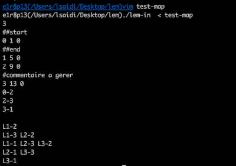

# lem-in
PATH FINDER IN GRAPH WITH 3D VISUALIZER

Lem-in project for 42 Khouribga.

In brief, the project consists in running a certain amount of 'ants' in the fastest way possible in an 'anthill'. My implementation uses `Edmonds karp's Max-flow` pathfinding algorithm.

# Getting Started

This project has only been compiled and tested on macOS Sierra (10.12.6). A few modifications might be necessary to compile it on any other system.

### Installing

After cloning the repository, simply run

```
make
```

to compile. An executable named ./lem-in should be created.

## How to use 'Lem-in'

lem-in takes commands on stdin. Tests and sample maps can be found in the [./generator].

```
Usage: lem-in < test_map
	./lem-in      : Starts lem-in in print mode. Shows only major steps.
	(-v) | ./visu : Starts lem-in in verbose mode. Shows every step lem-in does.
```

## How to use 'generator'

put the result of generator in file `./generator > test-map`

```
options:
	--help : to read the manual
	--flow-one : generates an ant farm with distinctive path and [1] ant in it
	--flow-ten : generates an ant farm with distinctive path and approximately [10] ants in it
	--flow-thousand : generates an ant farm with distinctive path and approximately [100] ants in it
	--big : generates a big map (approximately [1000] rooms) to test the time complexity
	--big-superposition : generates a big map with overlapping paths
```

### Map format (input)

A map is made of ***rooms*** and ***tubes***. ***Rooms*** are linked by ***tubes***. All distances are equal to 1.

The first line of a map must be the number of ants that will run through the map.

```
1337
```

Any other line must be either a ***room descriptor***, a ***tube descriptor***, a ***command***, or a ***comment***.

#### Room

A ***room descriptor*** is a line with 3 fields separated by a space **' '**. The first field is the **room name**. Any name is legal, as long as it contains no space and doesn't start with **'L'**. The two other fields represents the coordinates of this room in a 2D environment. Those coordinates are completely ignored by the lem-in executable, but will be printed back on the output for more processing.

```
room_name x y
```
#### Tube

A ***tube descriptor*** is a line with 2 fields separated by a dash **'-'**. Each field must be the name of a valid room.

```
room_1-room_2
```

#### Command

Any line that starts with two **'#'** is a  ***command***. lem-in only interprets two commands: **'##start'** and **'##end'**. A map without one of those commands will result in an error. They must be located before a valid ***room descriptor***. Any other command will be ignored and printed back on the output for more processing.

```
##start
room_1 0 0
```

#### Comment

Any line that starts with one **'#'** is a  ***comment***. Any comment will be ignored and printed back on the output.

```
#comment
```

### Result (output)

First, the map is fully printed back.

Then, the result will contain as many lines as there is cycles. Each cycles contains *n* movements.

## Examples



## Author

* **Lahcen Saidi (lsaidi)**

